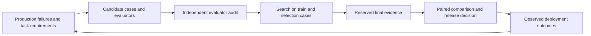

# Charter: what agent-eval owns

`agent-eval` owns evaluation data, scoring, experiment decisions, and release evidence.
It lets a host automate candidate generation while preserving the evidence needed to challenge the result.

## Package boundary

| Concern | Owner |
|---|---|
| Portable agent contracts and canonical encodings | `agent-interface` |
| Cases, judge scores, run records, statistical comparisons, evidence admission, and release rules | `agent-eval` |
| Agent sessions, workers, tool access, model execution, and research orchestration | The host, including `agent-runtime` |
| Product activation, business outcomes, storage authorization, and access to final data | The consuming application |

`agent-runtime` and `agent-knowledge` can depend on Eval.
Eval must not depend on either consumer, including through development or type-only imports.
Execution enters through caller-supplied functions.

## Decisions the package supports

**Did the agent perform the required task?**
A clean process exit or a fluent answer cannot establish that the required artifact works.
Campaigns retain results, failures, deterministic checks, semantic judgments, traces, and measured usage.
[Completion verification](../src/completion-verifier.ts), [layered verification](../src/multi-layer-verifier.ts), and [trace replay](./trajectory-replay.md) support checks on produced work.

**Did a change improve the agent?**
A comparison needs paired evidence, explicit exclusions, and an appropriate independent observation unit.
An improvement decision also needs a declared meaningful effect.
[Campaign gates](./eval-surface-map.md) and [registered experiments](./experiment.md) make those decisions inspectable.
Train and selection data can guide search; final evidence supports the resulting comparison.

**Does the evaluator measure the intended outcome?**
Known good and known bad controls test different errors.
[Evaluator admission](./evaluation-integrity.md), [judge calibration](./concepts.md#judge-calibration), and [outcome validity](./outcome-validity.md) describe what the measurements establish.
Outcome association can motivate an experiment; it cannot establish that changing a rubric causes improvement.

**Can another reader verify the evidence?**
[Evidence receipts](./experiment.md) bind reports to declared identities and provenance.
The [search ledger](./search-ledger.md) records every node, edge and cell of a search, and its receipt proves the search closed.
[Verdict certifications](./verdicts.md) name the checker and its unverified assumptions.
The [evidence registry](../evidence/README.md) retains published measurements and their freshness state.

## Implemented foundations

The current implementation includes:

- Registered decision rules, sealed experiments, admission funnels, matched-budget checks, and cluster-aware power refusal in [`/experiment`](../src/experiment/index.ts).
- Paired comparisons, exact binary inference, multiplicity corrections, and sequential gates in [statistics](../src/statistics/index.ts) and [campaign gates](../src/campaign/gates/).
- Declarative analyst definitions and caller-owned engine binding in [`/analyst`](../src/analyst/index.ts).
- Executed repair grading and replay in [`/trace-repair`](../src/trace-repair/index.ts) and [`/trajectory-replay`](../src/trajectory-replay/index.ts).
- Verification strategies and blind equivalence checks through a [caller-supplied checker](./verification-strategies.md).
- Claim metadata, durable final-evidence reservations, and evaluator admission through the [evaluation integrity API](./evaluation-integrity.md).

The [benchmark-book review](./design/mlbenchmarks-book-review.md) separates observed defects, existing capabilities, and proposed research.
Its archived measurements describe the reviewed revision.
Current source and regression tests define present behavior.

## Automating evaluation engineering

The host can generate candidate cases, checks, rubrics, and agent changes.
Eval checks whether their evidence supports the declared decision.
The same authoring loop must not silently turn its own generated labels into independent certification.

A host can compose this loop:

Every revision to an evaluator or candidate changes the object being tested.
Once final evidence influences that revision, the next confirmation needs fresh evidence.
Reusable comparisons can declare their population and unit without consuming final evidence.
Opting into a shared final-evidence ledger records fresh-confirmation exposure across campaigns.
It cannot enforce secrecy outside the host that uses it.

## Remaining boundaries

A package cannot establish population coverage from a dataset name.
Sampling plans still need production context, source lineage, and checks for missing groups.
More repetitions improve measurements on existing units; they do not add independent tasks.

Generated evaluators need an independent source of expected behavior.
The host must enforce author/auditor separation and prevent access to final evidence.
Declared identities and digests make these assumptions inspectable without proving them.

A checker for an open research problem must run through its actual verification backend.
The checker port supports proof kernels, invariants, replication, and agreement checks.
A strategy name alone supplies no evidence that any of those checks executed.

Product activation and continuous monitoring stay with the host.
Eval returns evidence and decisions; it does not grant deployment authority or choose a research agenda.

## Standing rules

- Keep missing evidence distinct from measured zero, failed execution, and a successful empty result.
- Preserve every attempted slot and its cost, including rejected candidates and service failures.
- Check practical effect, independence, power, and capture completeness before interpreting a positive score.
- Keep refusals and exclusions inside the result artifact.
- Require current canonical envelopes for seals and attestations.
- Preserve historical evidence as recorded, even when current APIs reject its retired format.
- Treat a negative result as evidence about the measured conditions and mechanism.
