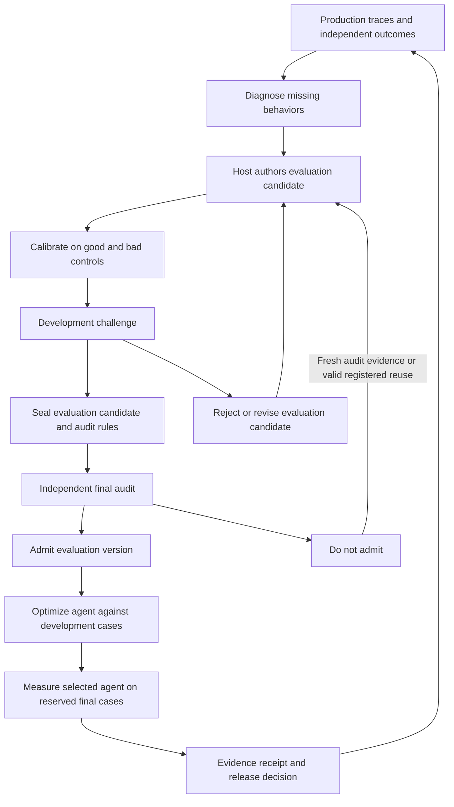

# What the benchmark book changes for agent-eval

Agent-eval should make the intended claim, evaluation population, and evidence lifecycle explicit before adding more autonomous search.
Its existing statistics and execution records provide a strong base.
The largest opportunity is to connect those instruments into a system that can propose, test, and revise evaluations independently of the agent being improved.

This assessment is for agent-eval maintainers deciding what to build next.
It reviews Moritz Hardt’s [The Emerging Science of Machine Learning Benchmarks](https://mlbenchmarks.org/) against repository revision `fe1cc5111aab5d588bf7db3a3785325635937a91`.
The exact inspected revision is also recorded in the [source manifest](./mlbenchmarks-review/sources.json).
The review date is September 12, 2026, in America/Los_Angeles.
Recommendations below are design proposals, not measured improvements or implemented runtime changes.

## Decision

Retain the current package boundaries and measurement primitives.
Prioritize three additions:

1. Bind each certification to its target population, independent observation unit, and intended use.
2. Track final-data exposure across campaigns, including what feedback reached candidate authors.
3. Admit generated evaluations through independent calibration and challenge before they can authorize agent improvements.

First repair the narrow measurement defects documented below.
An automated researcher that consumes the wrong outcome metric can optimize in the wrong direction faster than a human reviewer notices.

Do not start with another optimizer, runner, statistics package, or general benchmark leaderboard.
Do not treat a high judge agreement score as proof that a model ranking is correct.
Do not make an evaluator’s own approval rate its optimization objective.

## Reading scope and method

The live index exposes **16 reading pages**, totaling **109,771 whitespace-delimited body words**.
That count includes notes, references, tables, and equation text.
We read all 16: preface, prologue, chapters 1–8, and chapters 10–15.
Three parallel reviews covered the full text; the repository mapping checked implementations, exports, relevant callers, tests, and offline behavior.
HTML text omitted by paragraph extraction was separately audited and read.
Figures and tables supporting the conclusions were checked against their HTML or PDF context.

**Chapter 9 remains unavailable.**
The book references an annotation chapter, but the live index jumps from 8 to 10.
The checked `/09-annotation.html`, `/09-data-annotation.html`, and `/09-annotations.html` paths returned HTTP 404.
This review does not claim coverage of an unavailable chapter or the forthcoming print edition.
We read chapter references as part of the book; we did not independently reproduce every cited study or read every cited paper.

The [manifest](./mlbenchmarks-review/sources.json) records every page URL, title, body count, and downloaded HTML SHA-256.
It preserves source identity without vendoring the book.
The [offline probes](./mlbenchmarks-review/probes.mts) and [observations](./mlbenchmarks-review/observations.json) preserve the local checks behind concrete findings.
The probes use deterministic or synthetic data and make zero paid model calls.
They establish behavior and assumption boundaries, not production defect rates or expected improvement sizes.

The search covered `src`, `tests`, `docs`, `examples`, and package exports at the inspected revision.
It did not audit deployed consumers, production traffic, or the implementation of agent-runtime and agent-knowledge.
An absent connection here may already exist in a downstream application.

## The book, chapter by chapter

The book supplies several kinds of support.
Mathematical results depend on their assumptions; benchmark studies describe particular settings; historical interpretations suggest mechanisms worth testing.
The architecture proposals are our applications of those sources.

| Reading | Main contribution and qualification | Consequence for agent-eval |
| --- | --- | --- |
| [Preface](https://mlbenchmarks.org/00-preface.html) | Frames benchmarks as both development instruments and scientific institutions. The book is a synthesis, not an agent evaluation implementation guide. | Evaluate the measurement process and its incentives, alongside individual agents. |
| [Prologue](https://mlbenchmarks.org/00-prologue.html) | Uses a learning-rate anecdote to question the search for a universal modeling trick. Its empirical lesson unfolds in later chapters. | Preserve empirical comparison and let the researcher choose methods. |
| [1. Introduction](https://mlbenchmarks.org/01-introduction.html#the-iron-rule) | Explains benchmark-driven competition through the ImageNet and language-model eras. Benchmark success and explanatory scientific progress are different achievements. | Keep mechanism tests and replication alongside winner selection. |
| [2. Populations and predictions](https://mlbenchmarks.org/02-populations-predictions.html#errors-and-metrics) | Defines prediction risk relative to a population, loss, and decision problem. Calibration, accuracy, precision, and recall answer different questions. | Record the target distribution and error consequences; a scenario digest does not establish population validity. |
| [3. Detecting differences](https://mlbenchmarks.org/03-detecting-differences.html#comparing-similar-models) | Develops sample requirements, iid assumptions, multiplicity, and discordance in paired correctness outcomes. Small differences can require substantial independent evidence. | Reuse paired and discordance-aware power checks; distinguish task count from repeated execution count. |
| [4. Holdout method](https://mlbenchmarks.org/04-holdout-method.html#whats-the-holdout-method-for) | Separates development feedback, model ranking, and capability measurement. Valid intervals within a dataset do not establish external validity. | Give exploratory reports, fixed-roster comparisons, and deployment claims different evidence requirements. |
| [5. Test set reuse](https://mlbenchmarks.org/05-test-set-reuse.html#guarantees-of-the-holdout-method-under-adaptivity) | Shows why adaptive feedback changes holdout guarantees. Worst-case attacks demonstrate possibility, not the prevalence of practical overfitting. | Track exposure and adaptive claim history across calls; preserve useful development feedback. |
| [6. Scientific crisis](https://mlbenchmarks.org/06-scientific-crisis.html#researcher-degrees-of-freedom) | Explains selection, low power, publication incentives, and researcher flexibility. A p-value is not the probability that a claim is true. | Retain failed attempts and amended rules, practical effect sizes, controls, and unresolved outcomes. |
| [7. Replication in machine learning](https://mlbenchmarks.org/07-replication-machine-learning.html#measurement-versus-ranking) | Studies cases where new test sets shift absolute accuracy while preserving much of the ranking. Evidence from ImageNet does not guarantee language-agent stability. | Distinguish rerunning identical artifacts from sampling new tasks and reproducing the conclusion independently. |
| [8. Forces against crisis](https://mlbenchmarks.org/08-forces-against-crisis.html#biases-and-heuristics) | Examines leaderboard mechanisms, human information filtering, and shared code. These partly explain empirical robustness; they are not universal protections. | Autonomous search needs explicit feedback policies because it may exploit details that humans ignored. |
| [10. Generative models](https://mlbenchmarks.org/10-generative-models.html#the-limits-of-scaling-laws) | Connects language modeling, scaling, training distributions, and downstream benchmarks. Better likelihood or fitted scaling laws need not establish product capability. | Measure complete executable profiles and user outcomes; keep model-level proxies in their stated role. |
| [11. Evaluating language models](https://mlbenchmarks.org/11-evaluating-language-models.html#confounded-evaluations) | Covers post-training, generative judges, shortcuts, contamination, and tune-before-test. Unequal task preparation can confound claims about base-model capability. | Declare whether the comparison concerns deployed products or adaptation potential; account for preparation when that claim requires it. |
| [12. The problem of aggregation](https://mlbenchmarks.org/12-problem-aggregation.html#problems-of-aggregation-and-voting-systems) | Uses social choice and empirical comparisons to expose ranking tradeoffs. No theorem says every task-specific aggregate is useless. | Preserve dimensions, target weights, subgroup denominators, and sensitivity to defensible alternative aggregation policies. |
| [13. When the model moves the data](https://mlbenchmarks.org/13-model-moves-data.html#what-performativity-means-for-model-evaluation) | Models deployments that change future data. Stability, optimality, and welfare differ; feedback-loop stories require evidence. | Record assignment, time, exposure, and affected populations; distinguish monitoring correlation from causal deployment effects. |
| [14. Evaluation at the frontier](https://mlbenchmarks.org/14-evaluation-frontier.html#agreement-alone-is-not-enough) | Shows why judge agreement can coexist with wrong rankings. Discusses debiasing, verification, simulation, and live experiments, each with limits. | Calibrate ranking errors against independent labels, challenge evaluators, and connect offline decisions to later outcomes. |
| [15. Epilogue](https://mlbenchmarks.org/15-epilogue.html) | Returns to the social and scientific choices behind measurement. More automation does not remove judgment about desirable outcomes. | Let domain owners define value and acceptable failures; automate evidence collection and scrutiny. |

### What transfers, and what does not

The most useful distinction is **development signal versus ranking versus capability certification**.
These uses require progressively stronger evidence.
A regression suite can be useful after repeated exposure without supporting a fresh claim about unseen tasks.
A ranking can reproduce across populations while every absolute success rate changes.
A perfectly reproducible computation can measure the wrong construct.

Chapter 8 suggests a specific automation risk.
Human researchers often discarded most benchmark feedback through heuristics and limited attention.
An autonomous optimizer can retain every score, failed attempt, trace, and explanation.
The book motivates testing whether that additional feedback increases overfitting; it does not establish that our optimizers currently do so.
Its [Ladder mechanism](https://mlbenchmarks.org/08-forces-against-crisis.html#leaderboard-error) releases score updates only after sufficiently large improvements.
The guarantees depend on the specified mechanism and observation assumptions.
A minimum-effect gate alone does not reproduce them.
Keep complete private audit evidence even when an optimizer receives restricted feedback.

Chapter 11 also requires a careful distinction.
Comparing two products with their actual prompts and tools is appropriate when those products are the alternatives being deployed.
Comparing underlying models’ learning potential may require equal task preparation, adaptation curves, and total preparation cost.
Automatically tuning every model would change the first question into the second.

At the frontier, independent agreement and formal verification remain conditional evidence.
Two agents can share a blind spot.
A proof kernel checks a formal statement, leaving the connection to the intended claim as a separate obligation.
The package’s [verification strategy model](../verification-strategies.md) already captures this distinction.

## What agent-eval already has

These are implementation findings, not an assessment of adoption in every consumer.
“Partial” means the named behavior exists but leaves a specific contract or integration gap.

| Concern | Checked implementation | Assessment and remaining gap |
| --- | --- | --- |
| Statistical comparisons | [statistics](../../src/statistics/index.ts), [paired decisions](../../src/paired-promotion-decision.ts), [heldout pairing](../../src/campaign/gates/statistical-heldout.ts) | Present. Paired tests, uncertainty, exact binary methods, multiplicity, and power do not need replacement. Claim scope and independent sampling units need stronger binding. |
| Cluster-aware design | [power](../../src/experiment/power.ts), [registered rule AST](../../src/experiment/ast.ts) | Present. The high-level campaign path does not automatically select these methods from a declared generalization target. |
| Executable preregistration | [define/seal/open](../../src/experiment/define.ts), [acceptance tests](../../tests/experiment/preregistration-acceptance.test.ts) | Present. Extend this rule representation instead of creating a second experiment language. |
| Sequential testing | [sequential gate](../../src/campaign/gates/sequential.ts), [e-process](../../src/statistics/sequential-eprocess.ts) | Present. Optional stopping within a valid stream differs from adapting hypotheses across streams or counting dependent replicas as independent evidence. |
| Search/final separation | [selfImprove](../../src/contract/self-improve.ts), [method comparison](../../src/campaign/presets/compare-optimization-methods.ts) | Present within calls. Final cases are withheld from method inputs. A persistent cross-campaign exposure policy is missing from these paths. |
| Dataset identity and access | [Dataset](../../src/dataset.ts), [contamination helpers](../../src/contamination-guard.ts), [labeled store](../../src/campaign/labeled-store/fs-adapter.ts) | Partial. Hashes, split labels, mutation locks, temporal sampling, and access logs exist. They do not establish secrecy, lineage independence, or one-time certification use. |
| Complete search history | [SearchLedger](../../src/campaign/search-ledger.ts), [search ledger documentation](../search-ledger.md) | Present. Reuse the canonical ledger; do not create another optimizer event log. Requiring complete history remains a caller policy. |
| Evidence identity and authority | [EvidenceReceipt](../../src/experiment/evidence-receipt.ts), [campaign receipts](../../src/experiment/campaign-evidence.ts), [registry](../../src/experiment/evidence-record.ts) | Present. These bind identities and preserve declared authority. Hashes and authority labels alone do not prove independent execution or valid sampling. |
| Judge quality and drift | [calibration](../../src/judge-calibration.ts), [sentinel](../../src/meta-eval/sentinel.ts), [plants](../../src/meta-eval/plants.ts) | Present. Per-candidate residual bias, ranking validity, and independent evaluator admission need composition. Position and self-preference helpers exist internally; only verbosity has a root public export. |
| Multiple objectives | [promotion policy](../../src/campaign/gates/promotion-policy.ts), [production gate](../../src/campaign/gates/default-production-gate.ts) | Present. Per-dimension regression guards and evidence vectors exist. Explicit target-population weights and aggregation sensitivity remain useful additions. |
| Outcome validity | [correlation study](../../src/meta-eval/correlation-study.ts), [rubric validity](../../src/meta-eval/rubric-predictive-validity.ts), [outcome store](../../src/meta-eval/outcome-store.ts) | Present. Repair the metric-selection defect below; define direction and observational limits before using correlations for automated steering. |
| Adaptation and causal primitives | [adaptation evaluation](../../src/rl/adaptation-eval.ts), [off-policy estimators](../../src/rl/off-policy.ts) | Present. The adaptation comparison needs pairing repair. IPS, SNIPS, and doubly robust estimation still depend on supplied propensities, overlap, and identification assumptions. |
| Generating reusable cases | [fixtures](../../src/campaign/fixtures.ts), [feedback trajectories](../../src/feedback-trajectory.ts), [analysts](../../src/analyst/index.ts) | Partial. Cases can be authored, replayed, and scored. The inspected package lacks a complete admission protocol for an autonomously authored evaluation. |
| Active and adversarial case selection | [curriculum](../../src/rl/active-curriculum.ts), [adversarial scenarios](../../src/rl/adversarial.ts), [fuzzing](../../src/fuzz/fuzz-agent.ts), [discrimination](../../src/campaign/scenario-selection.ts) | Present. Extend population and exposure accounting around these primitives; do not propose a first automatic case-generation loop. |
| Automated improvement | [contract](../../src/contract/index.ts), [Researcher](../../src/researcher.ts), [predictive-validity researcher](../../src/rl/predictive-validity-researcher.ts) | Partial. Optimizer adapters and inspect/propose/apply/evaluate contracts exist. The predictive-validity researcher recommends changes but does not execute plans. |
| Verification without answer keys | [strategy/checker port](../../src/verification-strategy.ts), [verdicts](../../src/verdict.ts), [repair grading](../../src/trace-repair/index.ts) | Present as contracts and applicable execution paths. Domain checkers remain injected; a universal verifier is neither provided nor justified. |

The [charter](../charter.md) is a dated inventory with some later additions described beneath its original missing list.
Current source already supplies cluster-aware power, sealed rules, funnels, and evidence receipts.
Treat those as foundations to connect, not unbuilt modules.

## Concrete findings from offline checks

The observations below are intentionally narrower than production reliability claims.
They use the actual library functions at the inspected revision.
The [probe source](./mlbenchmarks-review/probes.mts) contains the complete inputs and invocation paths.
The archived probes target review snapshot `dda9941437190c9c541b3f54946bfeeb153366fe`, whose implementation matches the inspected source.
Run `pnpm exec tsx docs/design/mlbenchmarks-review/probes.mts` there after installing the locked dependencies.
Use an isolated checkout without concurrent source edits.
Current APIs have breaking changes, so these historical probes cannot run unchanged against current implementation code.
Current regressions and the [integrity example](../../examples/evaluation-integrity/) verify the replacement behavior.
It prints current observations without asserting that the recorded defects must persist.
The source identity hashes actual files under `src`, plus `package.json`, `pnpm-lock.yaml`, and `tsconfig.json`.
A separate hash identifies the diagnostic itself.
These identities survive documentation commits and change with local source edits, including untracked files.
They assume dependencies were installed from the lockfile; they do not fingerprint installed packages or the host environment.

| Finding | Observed result | Consequence and bounded correction |
| --- | --- | --- |
| Final evidence can be reused across independent calls | Two `selfImprove()` calls each dispatched baseline and candidate on the same six final cases: 12 final dispatches per call. Both returned `ship`, with the same final-set digest. | Confirms no cross-call consumption guard on this path. Add exposure-aware certification policy; this probe does not demonstrate empirical overfitting. |
| Outcome correlation can select the wrong metric | Ten synthetic runs had `csat = score` and an earlier object key with the opposite trend. Default `latest` returned correlation −1 for `csat`; `mean` returned +1. | [The reducer](../../src/meta-eval/correlation-study.ts) does not receive the requested metric name. Preserve metric identity when selecting the latest eligible outcome. |
| Adaptation comparison accepts unrelated tasks | Curves with disjoint scenario IDs can return `a_better`. The implementation computes separate marginal intervals and compares point summaries. | [The comparison](../../src/rl/adaptation-eval.ts) claims pairing without joining IDs. Use the existing paired machinery, report missing pairs, and distinguish descriptive curves from release evidence. |
| Exchangeability alone cannot validate the sequential gate | Choose one fair sign per experiment and repeat it for 100 cells. The positive state promotes after 15 observations; the negative state does not. | [The gate commentary](../../src/campaign/gates/sequential.ts) overstates exchangeability and shuffling. Under this marginal-zero construction, false promotion is 50%; the required conditional-mean assumption fails. |

The sequential example is an exact two-state counterexample, not a Monte Carlo estimate.
It challenges the stated assumption boundary, not the conditional-mean theorem underlying an e-process.
Shuffling correlated replicas does not manufacture independent tasks.

Two additional source findings matter before automating interpretation.
In [rubric predictive validity](../../src/meta-eval/rubric-predictive-validity.ts), the `load_bearing` classification uses absolute correlation.
Strong negative association can therefore earn that label; tests make magnitude-based behavior intentional despite contradictory interface prose.
Require an explicit outcome direction before treating this label as a recommendation to increase rubric weight.
This already affects [PredictiveValidityResearcher](../../src/rl/predictive-validity-researcher.ts).
Given nonempty failures, it can recommend up-weighting the top `load_bearing` rubric without checking the correlation’s sign.
The correction must reach that consumer as well as the report vocabulary.

In the [contamination probe](../../src/rl/contamination.ts), per-item `qValue` is derived from `1 - abs(delta)` before adjustment.
That quantity has no demonstrated p-value calibration.
The global paired Wilcoxon calculation is separate and should not be conflated with these display values.
Remove inferential naming from the heuristic or introduce a justified repeated-sample model.
Perturbation sensitivity can reflect changed difficulty as well as contamination.

The open safety-floor change was a separate worktree and PR during this review.
This assessment does not duplicate ownership of that gate or assume its changes were present in the inspected base.

## Prioritized improvements

### 1. Bind the claim to the design

**Recommendation: adapt; highest architectural priority.**
Extend the existing experiment definition with claim metadata and mechanically checked obligations.
Do not create a new runner or parallel estimator family.

The record should name the intended use, target population, sampling frame, observation unit, clustering, timeframe, outcome direction, and practical effect threshold.
It should identify whether the population is fixed, sampled independently, or affected by deployment.
It should retain exclusions, selection probabilities when known, and reasons when they are unknown.

For a frozen task roster, repeated executions can estimate execution variability conditional on that roster.
For unseen-task claims, resample independent tasks or task families through the existing cluster-aware methods.
Variants derived from one incident should retain their common source identity.
Twenty rewrites of one failure are not twenty independent examples of customer demand.
The method-comparison path reduces repetitions to scenario means; the primary heldout gate counts `scenario:rep` cells.
Make that choice follow the claim instead of treating either convention as universally correct.

Preflight power at the minimum worthwhile effect using the actual registered decision procedure.
The existing `power-floor` gate asks whether maximum power anywhere on its supplied effect grid reaches the target.
A fixture with power 0.1 at effect 0.01 and power 1 at effect 1 passes its target-0.8 check.
Those values are supplied curve points, not measured operating characteristics.
The result matches the gate’s structural-feasibility semantics; it does not establish adequacy for detecting an effect of 0.01.

**Smallest decisive check:** compare one task repeated 100 times with 100 independent tasks.
Both designs should expose the same execution count and different independent-unit counts.
A claim about unseen tasks must not acquire precision merely by duplicating the first task.
Reject this addition if the same safety and clarity can be obtained by composing existing typed fields without a new contract.

### 2. Account for evidence exposure across campaigns

**Recommendation: adapt; prerequisite for autonomous certification.**
Bind final-set commitments, task-family lineage, claim identity, and released feedback to the canonical ledger.
The host should reserve and consume final evidence through a durable operation with retry identity.
The record must distinguish replaying one completed measurement from opening evidence for a new adaptive decision.

Keep ordinary regression and exploratory reuse available and labeled.
For certification, support a frozen comparison, registered sequential collection of new valid observations, or refreshed final data.
A seed change or new run directory does not make an exposed task fresh.
Concurrent hosts must not each mint an apparently unused reservation for the same claim and evidence.

The runtime owns file permissions, model context, storage credentials, and separation between authors and final evaluators.
Eval owns the portable access/consumption record and the certification refusal.
An append-only record cannot prove secrecy if the host lets the author read the answer files.

**Smallest decisive check:** reproduce the two-call probe with one final-set reservation shared across restarts and two competing workers.
Require an explicit reuse policy before another adaptive certification can consume it.
Then compare full-trace, score-only, and thresholded development feedback on a null benchmark and an untouched replica at equal total spend.
That experiment tests whether formal information restrictions are worth their operational cost.
Defer a differential-privacy or reusable-holdout implementation until this measurement supports it.

### 3. Treat evaluation authoring as a measured task

**Recommendation: adapt the existing composition; largest automation opportunity.**
An evaluation candidate should be a versioned bundle of fixture references, checker identities, rubric, population description, and sealed decision rules.
The bundle should reuse `Scenario`, `JudgeConfig`, `VerificationStrategy`, `SealedExperiment`, and `EvidenceReceipt`.
Introduce only the missing admission and lineage fields.

The evaluator’s objective is detecting consequential defects while accepting independently verified good behavior.
High agent scores, high judge agreement, and large test counts are insufficient objectives.
A checker that rejects every output has excellent defect recall and no useful decision quality.

**Smallest decisive check:** give an eval author one real failure trace and a bounded budget.
Require a reproducible fixture, a correct reference, realistic negative controls, and an independently held audit set.
Compare its selected checker with a maintained human checker and a simple deterministic baseline.
Measure false acceptance and rejection, coverage by defect family, unknowns, flakiness, cost, and decision changes.
The winning author must improve audited decisions without weakening the accepted behavior.

### 4. Measure ranking validity and aggregation sensitivity

**Recommendation: adapt the calibration and reporting modules.**
Keep the evidence vector and per-dimension gates.
Add reports for per-candidate judge residuals against independent labels and uncertainty in pairwise ranking differences.
Good global agreement can hide a small directional bias that reverses a close comparison.

Retain subgroup counts and report the result under a few domain-approved population weights and normalization choices.
Record rank reversals and subgroup regressions rather than automatically choosing favorable weights.
Any data-driven choice of aggregation belongs to development and needs a later independent assessment.

**Smallest decisive check:** construct a panel with high aggregate agreement and known candidate-specific bias.
The ranking audit should catch the reversal while the existing agreement summary remains high.
For aggregation, change irrelevant alternatives and approved weights while keeping the focal models’ raw scores unchanged.
Report sensitivity without declaring that every aggregate is invalid.

[Prediction-powered inference](https://mlbenchmarks.org/14-evaluation-frontier.html#prediction-powered-inference) is a promising later experiment.
It combines many inexpensive predictions with a smaller independent labeled sample to correct measurement bias.
Compare its interval coverage and cost against an equally funded human-only estimator under candidate-specific and shifting bias.
The reference/proxy pairs and proxy-only sample must represent the same target population.
A bias correction does not resolve an undefined target construct.
The chapter derives a factor-two effective-sample-size ceiling for its considered unbiased estimators under a specified binary-score regime.
That regime requires agreement between 0.5 and the candidate’s reference score.
It does not bound every form of judge assistance or tool-based verification.
Measure coverage and total cost instead of assuming inexpensive proxy labels produce large savings.

### 5. Distinguish reproducibility from replication and transfer

**Recommendation: adapt existing receipts and experiment comparisons.**
Record whether a result reuses exact data, samples new tasks, changes the implementation, or tests another environment or population.
Use those distinctions in evidence records and reports.
Replicas should state which conclusion must reproduce: absolute performance, pairwise lift, ranking, or a proposed mechanism.

For claims about adaptation potential, compose repaired adaptation curves with method comparison and complete preparation costs.
Pin what each arm may change and which demonstrations it sees.
For product selection, preserve the actual deployed profile as the treatment being compared.

**Smallest decisive check:** rerun a fixed comparison on a newly sampled task cohort with preserved inclusion rules.
Check absolute score movement and paired/ranking movement separately.
Do not call a cache replay an independent replication.
Measure selection regret: the target loss incurred by choosing a candidate from the source benchmark.
A mostly preserved ranking can still select the wrong winner or leave every candidate below an operational reliability threshold.

### 6. Make deployment feedback interpretable

**Recommendation: adapt; execution remains downstream.**
After fixing outcome selection, extend outcome provenance with assignment, eligibility, exposure, observation window, and censoring information where the host can supply it.
Distinguish missing outcomes from users who experienced no event.
Record when the agent changes which tasks arrive, which users remain, or which feedback is observed.

Use outcome correlation as a diagnostic hypothesis.
Use randomized deployment comparisons when feasible, or existing off-policy estimators when their assumptions and propensities are defensible.
Neither correlation nor a stable feedback loop establishes that a change caused an improvement.

**Smallest decisive check:** build a two-cohort example where aggregate satisfaction rises because difficult users disappear while both cohorts worsen.
The report should expose changed denominators and within-cohort effects.
A production experiment should then measure whether the suspected selection mechanism actually occurs.

## A design for automated evaluation engineering

Here, “Software 3.0” means agents authoring executable evaluation assets and learning how to improve them.
This is a proposed system design derived from the review, not terminology or an architecture prescribed by the book.

Use three connected loops with separately versioned objectives and evidence.
Keep the evaluator fixed during each agent comparison.
Keep the independent evaluator audit fixed during each evaluation-design comparison.
Use deployment observations to challenge whether either comparison still represents the intended outcome.

The host chooses methods and coordinates workers.
The diagram does not move agent execution into this package.
Final-audit feedback consumes its independence, whether the candidate passes or fails.
Another revision requires fresh audit evidence or a registered protocol that justifies the proposed reuse.

| Stage | Required artifact | Existing building block | New obligation |
| --- | --- | --- | --- |
| Diagnose | Cited failure hypothesis and affected population | Trace analysts, feedback trajectories, replay | Explain why the case matters beyond being easy to generate. |
| Author | Fixture/checker/rubric bundle with source identities | Eval fixtures, datasets, checker ports | Separate author-visible material from sealed labels and final cases. |
| Calibrate | Known-good and known-bad outcomes, with execution evidence | Plants, golden calibration, verifiers | Reject inert checks, always-reject checks, and checks that reward the author’s own wording. |
| Challenge | Independently constructed development counterexamples and adjudicated disagreements | Blind equivalence protocol, repair execution, judge calibration | Measure defect-family coverage, false decisions, and source independence. |
| Seal and audit | Frozen candidate, registered rules, and independent final audit | Sealed experiments, power checks, funnels | Bind population, observation unit, exposure policy, and audit authority; consume final-audit evidence on disclosure. |
| Improve agent | Complete candidate history and detached selected artifact | `selfImprove`, optimizer adapters, SearchLedger | Prevent evaluator or final-case changes inside the comparison. |
| Certify | Paired final results and exact evidence bindings | Campaigns, gates, EvidenceReceipt | Verify final-evidence reservation and required evaluator health. |
| Revalidate | Later outcomes and an explicit replication decision | Outcome stores, sentinel, evidence registry | Distinguish drift, changed populations, and candidate-caused feedback. |

### How to evaluate the eval author

The unit of observation should be an independent task or incident family with independently adjudicated outcomes.
Split entire families and generator sources across authoring, selection, and final audit.
Do not let the author choose which of its failures disappear from the denominator.

Give every author the same source evidence, tool access, labeling allowance, and total measured budget.
Account for generation, calibration, challenge, failed executions, review, and final scoring.
Equal numbers of generated tests are not equal resources.

Compare three approaches initially: a maintained human procedure, a simple fixture-and-mutation procedure, and one autonomous author.
Use existing method comparison and sealed experiment machinery wherever their contracts fit.
Prefer one bounded pilot domain with executable ground truth before semantic or frontier research tasks.
For optimizing the target agent, include simple sample-and-verify selection as a baseline when outcomes are executable.
Charge its sampling and verification against the same total resource allowance.

The primary decision should concern false acceptance of consequential defects under a predeclared acceptable false-rejection limit.
Report both error rates with denominators and uncertainty, along with coverage, inconclusive outcomes, run failures, latency, and complete cost.
Report the distribution across task families; an average can hide a completely untested failure class.
Use an independently chosen practical effect threshold and cluster-aware power calculation to set the final sample size.
Calibrate the complete workflow on known nulls and known improvements across repeated independent experiments.
Include case authoring, candidate selection, stopping, and final confirmation in that measurement.
An isolated estimator’s error rate does not certify the larger adaptive procedure.

Test transfer to new repositories, task families, and later failure incidents before claiming a general eval engineer.
Measure whether the admitted evaluator changes actual release decisions correctly.
Generating plausible tests is only an intermediate artifact.

### Stop the recursive trust problem at explicit authority

The same agent may propose changes to the system and to its evaluator in separate experiments.
It must not certify its own change by altering the standard during the comparison.
When a rubric or checker changes, version it and remeasure both arms under that version.
A prompt edit to the evaluator cannot retroactively improve the candidate’s recorded result.
Before combining both changes, score old and new agent outputs under both old and new evaluators.
Independent references in this crossed comparison distinguish an agent improvement from a changed measuring instrument.

The final audit should use a separately controlled evidence source: executable ground truth, independent labels, replication, or an appropriate checker.
Different model families can reduce one source of shared bias; they do not prove independence or correctness.
The host must enforce separation and retain actual access evidence.
An authority field records the declaration; it does not authenticate the declaration by itself.

For tasks without answer keys, retain the checker’s stated assumptions and unresolved obligations.
Request a better observation or narrower claim when no available check can discriminate success from failure.
Do not resolve that limit by adding more mutually agreeing agents.

### Allocate work by the uncertainty that changes the decision

A downstream controller can choose between collecting new tasks, adding repetitions, buying independent labels, challenging a checker, or testing another mechanism.
Eval should provide the evidence and cost estimates for that choice.
It should not hard-code a research strategy into the substrate.
Compose existing curriculum, discriminative selection, and adversarial exploration where they fit.
The proposed addition concerns valid allocation and comparison of those choices, rather than their initial implementation.

If uncertainty comes from task diversity, collect new task families.
If it comes from execution noise on a fixed roster, add repetitions.
If the judge is biased, buy independent labels or execute a stronger check.
If every candidate ties, inspect case discrimination and metric resolution before proposing another architecture.
Retain a representative final sample when development uses deliberately difficult or discriminative cases.

This controller is worth implementing only after a pilot compares it with a fixed allocation at equal actual cost.
Measure correct decisions per budget, not the amount of activity it schedules.

## Build order and decisions to defer

| Order | Deliverable | Evidence required before continuing |
| --- | --- | --- |
| First | Repair outcome metric selection and adaptation pairing; correct sequential assumption guidance and ambiguous metric labels. | Focused regressions using the reproduced counterexamples and valid controls. |
| Next | One claim contract and final-exposure integration through existing seals, ledgers, and gates. | Independent-unit, restart, duplicate-use, concurrency, and information-access boundary checks. |
| Pilot | One runtime-owned eval author that emits ordinary fixtures and registered evaluations. | Independent final audit against human and simple baselines at equal measured resources. |
| Expand | Ranking-bias audits, aggregation sensitivity, and fresh-cohort replication. | Show that each addition changes a previously wrong or unresolved decision. |
| Conditional | Prediction-powered inference and adaptive allocation of labels or compute. | Demonstrated coverage, reduced decision error, and measured cost benefit under relevant bias and drift. |

Retain official optimizers and the single campaign execution path.
Reject duplicating the ledger, experiment language, receipt format, or generic researcher loop merely to package this proposal.
Defer a universal scalar capability score, an automatically learned definition of user value, and unrestricted evaluator self-modification.
The book supplies reasons to distrust those shortcuts, not evidence that a larger autonomous loop will overcome them.

## Verification and limits

Local typechecking, build, and package verification passed at the inspected revision.
The diagnostic passed a separate strict TypeScript check, and all seven outputs reproduced exactly on a second execution.
An isolated archive of the reviewed source reproduced the complete diagnostic output, including source identity.
Eleven focused provenance checks covered that reproduction, local changes, documentation stability, and refusal of symlinks and special files.
The Vitest run completed with **399 passed files, 2 skipped files; 5,876 passed tests, 3 skipped tests**.
The recorded test invocation expanded to the full suite; the exact command is preserved with the observations.
No production evaluation campaign, paid optimization experiment, or deployment was performed.

Source inspection and the offline probes support the gaps and defects identified here.
They do not establish downstream prevalence, adoption cost, or expected performance gains.
The proposed experiments state what evidence would justify implementation or reject the proposal.
